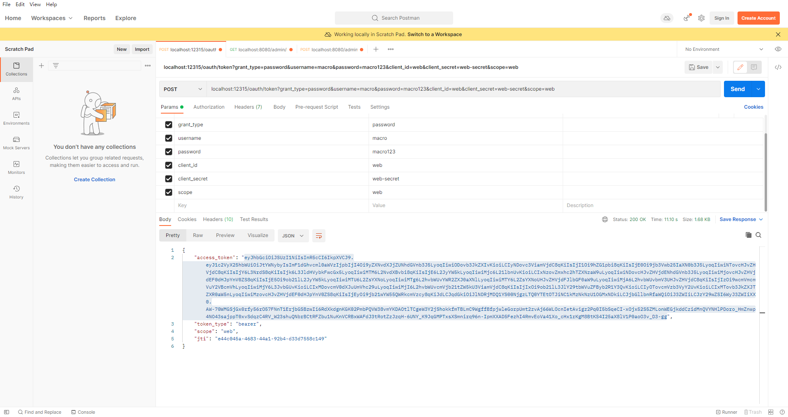
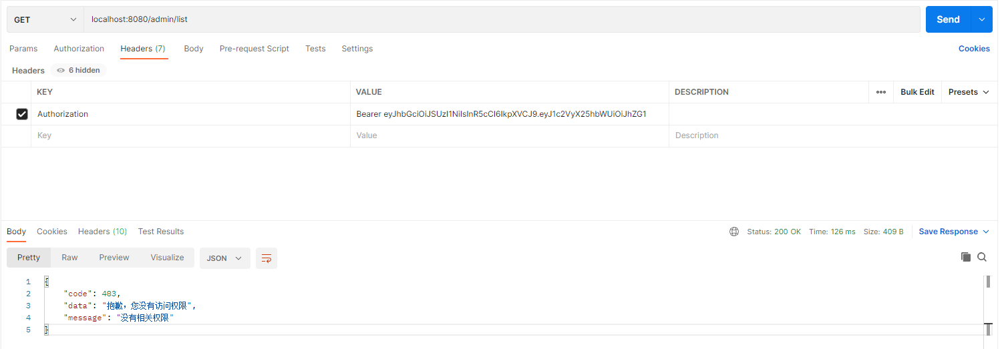

微服务Oauth2.0授权中心整合案例、分布式事务整合案例 
    platform-sso: Oauth2.0授权中心 
        Post请求：localhost:12315/oauth/token?grant_type=password&username=macro&password=macro123&client_id=web&client_secret=web-secret&scope=web
 
    platform-admin: 后台管理服务 

    platform-common: 公共服务封装
    platform-mbg: mybatis逆向工程